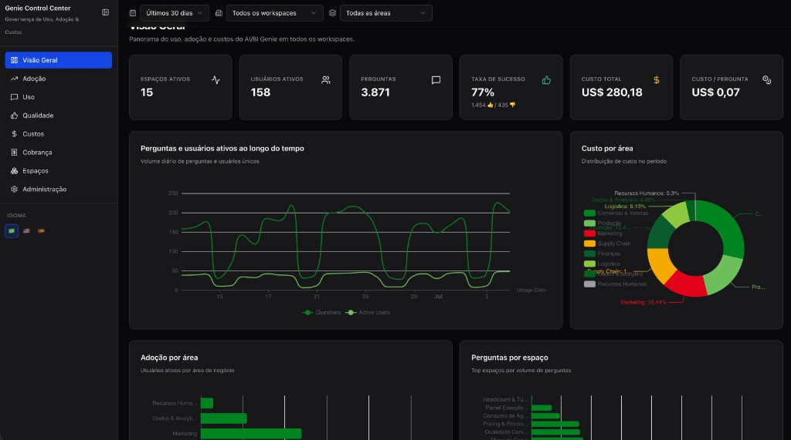
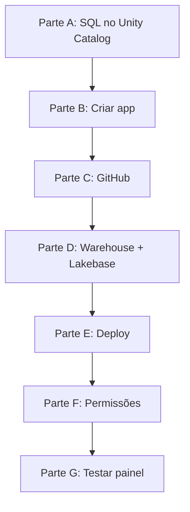

# Instalação pela interface visual — guia para iniciantes

Este documento é para **quem nunca usou linha de comando** e vai instalar o **Genie Control Center** apenas pelo **navegador**, na tela **Databricks Apps** do workspace.

Você **não precisa** instalar Git, Node.js ou Databricks CLI no seu computador. Tudo é feito clicando no workspace Databricks e copiando um script SQL do GitHub.

**Repositório oficial:** https://github.com/mousasdatabricks/genie-control-center  
**Branch a usar:** `main` (sempre a mais recente estável)

> **Tem um time técnico com terminal?** Eles podem usar [INSTALL.md](INSTALL.md) (Databricks Asset Bundles). Este guia é o caminho **visual**.



*Exemplo da tela **Visão Geral** após o deploy (dados de demonstração).*

---

## Índice

1. [O que é isso, em linguagem simples](#1-o-que-é-isso-em-linguagem-simples)
2. [O que você precisa ter antes](#2-o-que-você-precisa-ter-antes)
3. [Glossário rápido](#3-glossário-rápido)
4. [Mapa completo da instalação](#4-mapa-completo-da-instalação)
5. [Parte A — Preparar os dados (SQL Editor)](#parte-a--preparar-os-dados-sql-editor)
6. [Parte B — Criar o app no Databricks](#parte-b--criar-o-app-no-databricks)
7. [Parte C — Conectar o GitHub](#parte-c--conectar-o-github)
8. [Parte D — Vincular Warehouse e Lakebase](#parte-d--vincular-warehouse-e-lakebase)
9. [Parte E — Fazer o deploy](#parte-e--fazer-o-deploy)
10. [Parte F — Liberar permissões](#parte-f--liberar-permissões)
11. [Parte G — Testar o painel](#parte-g--testar-o-painel)
12. [Atualizar depois](#atualizar-depois)
13. [Personalizar logo e nome da empresa](#personalizar-logo-e-nome-da-empresa)
14. [Problemas comuns (e o que fazer)](#problemas-comuns-e-o-o-que-fazer)
15. [Checklist para imprimir](#checklist-para-imprimir)

---

## 1. O que é isso, em linguagem simples

### O Genie Control Center

É um **site interno** (painel) que abre dentro do ecossistema Databricks e mostra, em gráficos e tabelas:

| Módulo | O que mostra |
|--------|----------------|
| Visão Geral | números resumidos de uso do Genie |
| Adoção | quantas pessoas usam, por área |
| Uso | perguntas, erros, por Space e usuário |
| Qualidade | feedback e taxa de sucesso |
| Custos | compute por Space/área |
| Billing Genie | custos Paygo (LLM), SKU, orçamentos |
| Spaces | lista de todos os Genie Spaces |
| Administração | metas, alertas, saúde das conexões |

### De onde vêm os dados?

```
Usuários usam Genie no workspace
        ↓
Databricks grava logs (system tables)
        ↓
Views no Unity Catalog organizam esses logs
        ↓
O app lê as views e mostra os gráficos
```

O **código do app** fica no **GitHub** (repositório público).  
Os **dados** ficam **só no seu workspace** — nada sai da Databricks.

### O que você vai fazer (resumo de uma frase)

1. Rodar um script SQL para criar tabelas/views.  
2. Criar um “Databricks App” apontando para o GitHub.  
3. Ligar um SQL Warehouse e um Lakebase ao app.  
4. Clicar em **Deploy**.  
5. Pedir ao admin para liberar permissões.  
6. Abrir a URL e usar.

**Tempo estimado:** 60–90 minutos na primeira vez (boa parte é esperar o build).

---

## 2. O que você precisa ter antes

### No seu computador

| Item | Necessário? |
|------|-------------|
| Navegador (Chrome, Edge, Firefox) | Sim |
| Conta no workspace Databricks | Sim |
| Git instalado | **Não** |
| Node.js instalado | **Não** |
| Terminal / linha de comando | **Não** |

### No workspace Databricks (peça ao administrador)

Copie esta lista e envie por e-mail/Slack para o time de plataforma **antes** de começar:

```
Olá, preciso instalar o Genie Control Center via Databricks Apps.
Podem confirmar se tenho / se existe:

[ ] Acesso ao menu "Databricks Apps" no workspace
[ ] Permissão para CRIAR apps e ADICIONAR RECURSOS a apps
[ ] Um SQL Warehouse (de preferência Serverless) já criado
[ ] Um projeto Lakebase (Postgres) com branch de produção
[ ] System tables habilitadas (audit, billing)
[ ] Permissão para criar schema/tabelas/views no Unity Catalog
[ ] Permissão para dar GRANT ao Service Principal do app (ou fazem por mim)
```

**Se algum item não existir, pare aqui.** Sem SQL Warehouse e Lakebase o app **não funciona**.

### Anote estes três nomes

Você vai precisar durante a instalação. Peça ao admin ou anote sozinho:

| # | O quê anotar | Onde achar no Databricks |
|---|--------------|--------------------------|
| 1 | **URL do workspace** | Barra de endereço do navegador. Ex.: `https://minha-empresa.cloud.databricks.com` |
| 2 | **Nome do SQL Warehouse** | Menu **SQL** → **SQL Warehouses** → copie o nome (ex.: `Serverless Starter Warehouse`) |
| 3 | **Nome do projeto Lakebase** | Menu **Compute** → **Lakebase** → nome do projeto |

### Prefixo do Unity Catalog

O repositório assume por padrão:

```
main.genie_cc
```

- `main` = nome do **catálogo**
- `genie_cc` = nome do **schema**

Se sua empresa usar outro nome (ex.: `acme_catalog.genie_analytics`), anote e use **sempre** esse prefixo no lugar de `main.genie_cc` neste guia.

---

## 3. Glossário rápido

| Termo | Significado simples |
|-------|---------------------|
| **Workspace** | Seu “ambiente Databricks” na nuvem — onde você faz login |
| **Unity Catalog (UC)** | Catálogo de dados organizado (catálogo → schema → tabelas/views) |
| **System tables** | Tabelas internas da Databricks com logs de uso e billing |
| **SQL Warehouse** | “Motor” que executa consultas SQL dos gráficos |
| **Lakebase** | Banco Postgres gerenciado pela Databricks; o app salva configurações aqui |
| **Databricks App** | Aplicação web hospedada pela Databricks |
| **Deploy** | Publicar/instalar o app — baixa código, compila e liga |
| **Git / GitHub** | Onde o código-fonte fica guardado (como uma pasta na nuvem com histórico) |
| **Branch `main`** | Versão principal estável do código |
| **Service Principal (SP)** | “Usuário robô” do app — precisa de permissão para ler dados |
| **Resource key** | Apelido interno de um recurso (warehouse, banco) — **não pode errar o nome** |

---

## 4. Mapa completo da instalação



| Parte | Onde | Tempo aprox. |
|-------|------|--------------|
| A | SQL Editor | 15–30 min |
| B–D | Databricks Apps | 15–20 min |
| E | Deploy (espera) | 5–15 min |
| F | SQL + Permissions | 10–20 min (muitas vezes o admin faz) |
| G | Navegador | 5 min |

---

## Parte A — Preparar os dados (SQL Editor)

**Objetivo:** criar no Unity Catalog as tabelas e views que o painel lê.

### A.1 Abrir o SQL Editor

1. Faça login no workspace Databricks.  
2. No menu lateral esquerdo, clique em **SQL**.  
3. Clique em **SQL Editor**.  
4. Clique em **+ New query** (ou botão equivalente de nova consulta).

Você verá uma área de texto grande — é onde colamos o script.

### A.2 Baixar o script do GitHub

1. Abra uma **nova aba** no navegador.  
2. Acesse: https://github.com/mousasdatabricks/genie-control-center  
3. Clique na pasta **`sql`**.  
4. Clique no arquivo **`views_prod.sql`**.  
5. No canto superior direito do código, clique no botão **Raw** (texto bruto).  
6. Selecione **tudo**: `Ctrl+A` (Windows) ou `Cmd+A` (Mac).  
7. Copie: `Ctrl+C` ou `Cmd+C`.

### A.3 Colar e ajustar o script

1. Volte para a aba do **SQL Editor**.  
2. Cole o script: `Ctrl+V` ou `Cmd+V`.  
3. **Substitua** o placeholder do catálogo/schema:

   O script contém várias linhas com:
   ```
   <<CATALOG>>.<<SCHEMA>>
   ```

   Você precisa trocar **todas** por seu prefixo real.

   **Como substituir tudo de uma vez (recomendado):**
   - `Ctrl+H` (Windows) ou `Cmd+Option+F` (Mac) — função “Localizar e substituir”
   - **Localizar:** `<<CATALOG>>.<<SCHEMA>>`
   - **Substituir por:** `main.genie_cc` (ou o prefixo da sua empresa)
   - Clique em **Substituir tudo** / **Replace all**

   **Confira:** não deve restar nenhum `<<CATALOG>>` ou `<<SCHEMA>>` no texto.

4. No topo do SQL Editor, escolha um **SQL Warehouse** para executar (dropdown). Use o warehouse que o app vai usar depois.  
5. Clique no botão **Run** (▶) ou pressione `Ctrl+Enter`.

### A.4 O que deve acontecer

- A execução pode levar **1–3 minutos**.  
- Você deve ver mensagens de sucesso (verde) ou “OK” para cada `CREATE`.  
- **Se aparecer erro vermelho:** leia a mensagem. Erros comuns:
  - *Permission denied* → você não tem permissão no catálogo; peça ao admin.
  - *Catalog not found* → o catálogo `main` não existe; troque pelo catálogo correto.
  - *Syntax error* → provavelmente sobrou `<<CATALOG>>` sem substituir.

### A.5 Conferir se as views existem

Nova query no SQL Editor, cole e execute (ajuste o prefixo se necessário):

```sql
SHOW TABLES IN main.genie_cc;
```

Você deve ver, entre outras:

- `dim_spaces`
- `dim_users`
- `v_genie_usage_daily`
- `v_genie_costs_daily`
- `v_genie_billing_sku_daily`
- `v_genie_llm_daily`
- (e outras `v_genie_*`)

Teste rápido:

```sql
SELECT COUNT(*) AS linhas FROM main.genie_cc.v_genie_usage_daily;
```

- Se retornar um **número** (mesmo `0`) **sem erro** → views OK.  
- `0` linhas é normal se ainda não houve uso de Genie nos últimos dias.

### A.6 Popular as tabelas dim_spaces e dim_users

O painel **precisa** saber quais são os Genie Spaces e a qual área cada usuário pertence.

| Tabela | Colunas importantes | De onde vêm os dados |
|--------|---------------------|----------------------|
| `dim_spaces` | `space_id`, `space_name`, `area`, `warehouse_id` | Lista de Genie Spaces do workspace |
| `dim_users` | `user_email`, `area` | Diretório / RH / SCIM |

**Na prática:** peça ao time de dados para popular. Se quiser testar com **um registro manual**:

```sql
-- EXEMPLO — troque pelos valores reais da sua empresa
INSERT INTO main.genie_cc.dim_spaces VALUES (
  '00000000-0000-0000-0000-000000000001',  -- space_id (UUID do Genie Space)
  'Meu Space de Teste',                     -- space_name
  'financeiro@empresa.com',                 -- owner_email
  'Financeiro',                             -- area
  1234567890123456,                         -- workspace_id (número)
  'seu-warehouse-id-aqui',                  -- warehouse_id
  5,                                        -- num_tables
  current_date()                            -- created_at
);

INSERT INTO main.genie_cc.dim_users VALUES (
  'voce@empresa.com',    -- user_email
  'Seu Nome',            -- display_name
  'Financeiro',          -- area
  1234567890123456,      -- home_workspace_id
  current_date()         -- joined_date
);
```

Sem dados nessas tabelas, os gráficos podem aparecer **vazios** ou com área **"Não classificado"** — o app ainda sobe, mas fica pouco útil.

### A.7 (Opcional) Demo sem dados reais

Para uma POC sem system tables, o time técnico pode usar `sql/demo_01_data.sql` + `sql/demo_02_views.sql`. Veja [examples/heineken/](examples/heineken/).

---

## Parte B — Criar o app no Databricks

**Objetivo:** registrar o app no workspace (ainda sem publicar).

### B.1 Abrir Databricks Apps

1. No canto **superior esquerdo**, clique no **seletor de produto** (ícone de grade ou nome do produto atual, ex. “Databricks”).  
2. Na lista, escolha **Databricks Apps**.  
3. Você verá a lista de apps (pode estar vazia).

**Não encontrou “Databricks Apps”?**  
→ Seu workspace pode não ter o recurso habilitado. Peça ao administrador.

### B.2 Iniciar criação

1. Clique no botão **+ Create app** (canto superior direito).  
2. Escolha **Create a custom app** (app personalizado — **não** use template genérico).

### B.3 Preencher nome e descrição

| Campo | Valor exato | Regras |
|-------|-------------|--------|
| **Name** | `genie-control-center` | Só letras minúsculas, números e hífen. Máx. 26 caracteres. |
| **Description** | `Genie Control Center — governança de uso e custos` | Texto livre |

**Não use:** `Genie_Control_Center`, `genie control center`, `GENIE-CC` — podem causar erro.

### B.4 Avançar sem fazer deploy ainda

O assistente pode mostrar vários passos (Git, recursos, etc.).  
**Não clique em Deploy** até terminar as Partes C e D.

Se o assistente pedir para escolher fonte de código:

- Escolha **Git repository** (não “workspace folder”).

---

## Parte C — Conectar o GitHub

**Objetivo:** dizer ao Databricks de onde baixar o código.

### C.1 Passo “Configure Git”

No assistente de criação **ou** depois em **App settings** → seção Git:

| Campo | Valor |
|-------|-------|
| **Git repository URL** | `https://github.com/mousasdatabricks/genie-control-center` |
| **Git provider** | `GitHub` |
| **Git reference** | `main` |
| **Reference type** | `Branch` |

**Copie e cole a URL exatamente** — sem espaço no final.

### C.2 Repositório público (este caso)

O repositório oficial é **público**. Você **não precisa** configurar senha nem token Git.

### C.3 Repositório privado (fork da sua empresa)

Se sua empresa fez **fork** privado:

1. Use a URL do fork em vez da URL pública.  
2. Na página do app, procure o aviso **Configure Git credential**.  
3. Clique e siga o fluxo para autorizar o GitHub da empresa.  
4. Só depois disso o deploy funciona.

### C.4 Deploy automático (opcional, avançado)

Se o workspace tiver o preview habilitado **e** o repo for privado no GitHub, você pode marcar:

- **Auto deploy on push events** — redeploya sozinho a cada commit na branch `main`.

Para a **primeira instalação**, pode deixar desmarcado.

### C.5 Salvar

Clique em **Create app** ou **Save**. Você volta para a **página de detalhes** do app `genie-control-center`.

---

## Parte D — Vincular Warehouse e Lakebase

**Objetivo:** o app precisa de dois “cabos” — um para SQL (gráficos) e um para banco (configurações).

O repositório já traz um arquivo `app.yaml` que espera estes **nomes de recurso (resource keys)**:

| Resource key | Tipo | Permissão | Para quê |
|--------------|------|-----------|----------|
| `sql-warehouse` | SQL Warehouse | **Can use** | Gráficos e KPIs |
| `postgres` | Lakebase database | **Can connect and create** | Página Admin (metas, orçamentos) |

> ⚠️ **CRÍTICO:** os resource keys devem ser **exatamente** `sql-warehouse` e `postgres`. Se digitar `sql_warehouse`, `lakebase` ou outro nome, o app **quebra** com variáveis de ambiente vazias.

### D.1 Abrir configuração de recursos

Na página do app `genie-control-center`:

1. Clique em **App settings** (ou ícone de engrenagem).  
2. Procure a seção **App resources** (Recursos do app).

### D.2 Adicionar SQL Warehouse

1. Clique **+ Add resource**.  
2. **Resource type:** `SQL warehouse`.  
3. **Select warehouse:** escolha o warehouse anotado na Parte 2 (ex.: Serverless Starter Warehouse).  
4. **Permission:** `Can use`.  
5. **Resource key:** digite `sql-warehouse` (com hífen, tudo minúsculo).  
6. Salve / confirme.

**Como achar o warehouse se não souber o nome:**

- Menu **SQL** → **SQL Warehouses** → use um que esteja **Running** ou **Stopped** (não precisa estar ligado antes do deploy; o app liga na hora da consulta).

### D.3 Adicionar Lakebase

1. Clique **+ Add resource** novamente.  
2. **Resource type:** `Lakebase database`.  
3. Selecione:
   - **Project** (projeto Lakebase)
   - **Branch** (ex.: `production`)
   - **Database** (ex.: `databricks-postgres` ou o nome que aparecer)
4. **Permission:** `Can connect and create`.  
5. **Resource key:** digite `postgres` (tudo minúsculo).  
6. Salve / confirme.

**Não tem Lakebase no menu?**

- Menu **Compute** → **Lakebase** → peça ao admin para criar um projeto antes de continuar.

### D.4 Conferir lista final

Na seção **App resources** você deve ver **exatamente 2 recursos**:

```
sql-warehouse   →  SQL Warehouse   →  Can use
postgres        →  Lakebase        →  Can connect and create
```

Se faltar um, adicione antes do deploy.

### D.5 O que o app faz no Lakebase sozinho

No **primeiro start**, o app cria automaticamente o schema `genie_cc` com tabelas de metas, thresholds, anotações e orçamentos. **Você não precisa** criar tabelas manualmente no Lakebase.

---

## Parte E — Fazer o deploy

**Objetivo:** baixar o código do GitHub, compilar e colocar o app no ar.

### E.1 Iniciar deploy

1. Na página do app, clique no botão azul **Deploy**.  
2. Escolha **From Git** (do Git — **não** “from workspace folder”).  
3. Preencha:

| Campo | Valor |
|-------|-------|
| Git reference | `main` |
| Reference type | `Branch` |
| Source code path | *(deixe vazio)* |

**Source code path vazio** = usa a raiz do repositório (correto para este projeto).

4. Clique **Deploy**.

### E.2 O que acontece (para você não se preocupar)

O Databricks automaticamente:

1. Clona o código da branch `main` do GitHub.  
2. Instala pacotes Node.js (`npm`).  
3. Compila o frontend e o servidor (`npm run build`).  
4. Inicia o servidor web (`npm start`).

**Primeira vez: espere 5 a 15 minutos.** É normal. Não clique em Deploy de novo.

### E.3 Acompanhar o status

Na página do app, observe o **Status**:

| Status | Significado | O que fazer |
|--------|-------------|-------------|
| `DEPLOYING` | Instalando | Aguarde |
| `RUNNING` | Funcionando | Abra a URL do app |
| `CRASHED` | Erro | Veja aba **Logs** (seção Problemas) |
| `STOPPED` | Parado | Clique **Start** ou redeploy |

**Abas úteis:**

- **Logs** — texto do build e erros (`error`, `failed`).  
- **Deployments** — histórico de cada tentativa.

### E.4 Abrir o app

Quando status = **RUNNING**:

1. Na página do app, copie ou clique no **link** (URL termina com `.databricksapps.com`).  
2. O painel abre em nova aba.  
3. Faça login com seu usuário SSO se pedido.

**Se a página abrir em branco ou der erro 403:** ainda faltam permissões — vá para Parte F.

---

## Parte F — Liberar permissões

O deploy **não** libera tudo sozinho. Faltam dois tipos de permissão.

### F.1 Descobrir o Service Principal do app

1. Na página do app → **App settings** ou seção **Identity**.  
2. Procure **Service principal** — anote o nome exato (ex.: `genie-control-center` ou `app-abc123`).

Esse é o “usuário robô” que lê os dados.

### F.2 Dar permissão nas views do Unity Catalog

Um **administrador** deve executar no **SQL Editor** (ajuste nomes):

```sql
-- Troque:
--   main          → seu catálogo
--   genie_cc      → seu schema
--   genie-control-center → nome do Service Principal do app

GRANT USE CATALOG ON CATALOG main TO `genie-control-center`;
GRANT USE SCHEMA ON SCHEMA main.genie_cc TO `genie-control-center`;
GRANT SELECT ON SCHEMA main.genie_cc TO `genie-control-center`;
```

**Como saber se funcionou:** abra o app → Visão Geral. Se antes dava erro e agora carrega (mesmo com zeros), OK.

### F.3 System tables

As views leem tabelas internas (`system.access.audit`, `system.billing.usage`, etc.). O Service Principal precisa de **SELECT** nelas.

Isso varia por workspace — normalmente o **admin do metastore** configura. Se os logs do app mostram `PERMISSION_DENIED` em `system.*`, encaminhe este guia ao admin: [BILLING-MONITORING.md](BILLING-MONITORING.md).

### F.4 Liberar usuários finais (SSO)

Cada pessoa que vai **abrir** o painel precisa de permissão no app:

1. Na página do app → aba **Permissions**.  
2. Clique **Add**.  
3. **Principal type:** Group (grupo — recomendado) ou User.  
4. Escolha o grupo do Azure AD / Okta (ex.: `databricks-users`, `genie-governance`).  
5. **Permission level:** `Can use`.  
6. Salve.

| Nível | Quem usa |
|-------|----------|
| **Can use** | Usuários finais que só abrem o painel |
| **Can manage** | Quem edita configuração e faz deploy |

**Teste:** peça a um colega do grupo para abrir a URL. Se ele vê “Access denied”, o grupo está errado ou falta `Can use`.

---

## Parte G — Testar o painel

Abra a URL do app e passe por esta lista:

### G.1 Visão Geral (página inicial)

- [ ] A página carrega sem erro vermelho.  
- [ ] Filtros de período / workspace aparecem no topo.  
- [ ] KPIs mostram números (podem ser zero se não houver uso).

### G.2 Billing Genie

- [ ] Menu lateral → **Billing Genie** (ou `/billing`).  
- [ ] Cards de resumo e tabelas carregam.

### G.3 Administração (teste mais importante)

- [ ] Menu → **Administração** (`/admin`).  
- [ ] Indicadores de **SQL Warehouse** e **Lakebase** estão **verdes**.  
- [ ] Edite uma meta por área → **Salvar** → recarregue a página (F5) → valor permanece.

Se Admin fica vermelho no Lakebase → revise Parte D.3 (`postgres`, permissão *Can connect and create*).

### G.4 Idioma

No canto da tela, troque **PT / EN / ES** — interface deve traduzir.

---

## Atualizar depois

Quando sair versão nova no GitHub:

1. **Databricks Apps** → `genie-control-center`.  
2. **Deploy** → **From Git** → branch `main` → **Deploy**.  
3. Aguarde status **RUNNING** de novo.

Não é necessário refazer Parte A (SQL) a menos que a release peça novas views — leia o changelog do repositório.

---

## Personalizar logo e nome da empresa

O app vem com branding neutro. Para colocar o nome do cliente:

1. No GitHub, faça **Fork** do repositório para a organização da empresa.  
2. No fork, edite o arquivo `client/src/lib/brand-config.ts` (campo `orgName`) — pode pedir ao time de dev.  
3. Na Parte C, use a URL do **fork** privado.  
4. Se mudar o schema UC, peça ao time para atualizar `config/queries/*.sql` (trocar `main.genie_cc`).

---

## Problemas comuns (e o que fazer)

### Deploy e Git

| Sintoma | Causa | Solução |
|---------|-------|---------|
| Deploy falha imediatamente | Repo privado sem credencial | **Configure Git credential** na página do app |
| “Repository not found” | URL errada | Confira URL do GitHub, sem espaços |
| “Reference not found” | Branch errada | Use `main` |

### Status CRASHED

| Sintoma | Causa | Solução |
|---------|-------|---------|
| CRASHED após vários minutos | Erro no build | Aba **Logs** → procure `error` / `npm ERR!` → envie print ao suporte |
| CRASHED logo ao iniciar | Resource key errado | Confira `sql-warehouse` e `postgres` (Parte D) |

### Dados e gráficos

| Sintoma | Causa | Solução |
|---------|-------|---------|
| Gráficos vazios, sem erro | Sem uso recente ou `dim_*` vazias | Normal em ambiente novo; popular Parte A.6 |
| Erro ao carregar dados | Views não criadas | Refazer Parte A |
| PERMISSION_DENIED nos logs | Falta GRANT no UC | Parte F.2 e F.3 |

### Acesso de usuários

| Sintoma | Causa | Solução |
|---------|-------|---------|
| “Access denied” na URL | Usuário sem Can use | Parte F.4 |
| Admin vermelho (Lakebase) | Recurso postgres incorreto | Parte D.3 |

### Demora

| Sintoma | Causa | Solução |
|---------|-------|---------|
| Deploy > 15 min | Primeiro build é pesado | Aguarde; monitore Logs |
| Página lenta | Warehouse pequeno ou cold start | Normal em serverless |

### Política do workspace

Alguns workspaces **só permitem** deploy via Git (não via pasta no workspace). Nesse caso, **sempre** use **From Git** — nunca “workspace folder”.

---

## Quando pedir ajuda

Monte um e-mail com:

1. URL do workspace (sem tokens de login).  
2. Nome do app: `genie-control-center`.  
3. Status atual (DEPLOYING / RUNNING / CRASHED).  
4. Print da aba **Logs** (últimas 50 linhas com erro).  
5. Prefixo UC usado (ex.: `main.genie_cc`).  
6. Confirmação: `dim_spaces` e `dim_users` estão populadas? (sim/não).

---

## Documentos relacionados

| Documento | Para quem |
|-----------|-----------|
| [INSTALL.md](INSTALL.md) | Time técnico (CLI + Asset Bundle) |
| [BILLING-MONITORING.md](BILLING-MONITORING.md) | Governança de billing Genie |
| [DEPLOY-CLIENT.md](DEPLOY-CLIENT.md) | Runbook resumido (inglês) |
| [examples/heineken/](examples/heineken/) | Demo com dados sintéticos |

---

## Checklist para imprimir

Marque cada item ao concluir:

**Pré-requisitos (admin)**  
- [ ] Databricks Apps habilitado  
- [ ] SQL Warehouse existe  
- [ ] Lakebase existe  
- [ ] System tables habilitadas  
- [ ] Permissão para criar objetos no UC  

**Parte A — Dados**  
- [ ] Script `views_prod.sql` executado sem erro  
- [ ] Prefixo `<<CATALOG>>.<<SCHEMA>>` totalmente substituído  
- [ ] `SHOW TABLES IN main.genie_cc` lista views `v_genie_*`  
- [ ] `dim_spaces` e `dim_users` populadas (ou agendado com time de dados)  

**Parte B–C — App + Git**  
- [ ] App criado: `genie-control-center`  
- [ ] Git: `https://github.com/mousasdatabricks/genie-control-center`  
- [ ] Branch: `main`  

**Parte D — Recursos**  
- [ ] Resource `sql-warehouse` → Can use  
- [ ] Resource `postgres` → Can connect and create  

**Parte E — Deploy**  
- [ ] Deploy From Git concluído  
- [ ] Status: **RUNNING**  
- [ ] URL do app anotada  

**Parte F — Permissões**  
- [ ] GRANT UC para Service Principal  
- [ ] System tables (admin)  
- [ ] Grupo SSO com **Can use**  

**Parte G — Teste**  
- [ ] Visão Geral abre  
- [ ] Billing Genie abre  
- [ ] Admin com indicadores verdes  
- [ ] Meta salva e persiste após F5  

**Entrega**  
- [ ] URL compartilhada com time de governança / CoE Genie  

---

*Última atualização do guia: compatível com o repositório `genie-control-center` branch `main`.*
