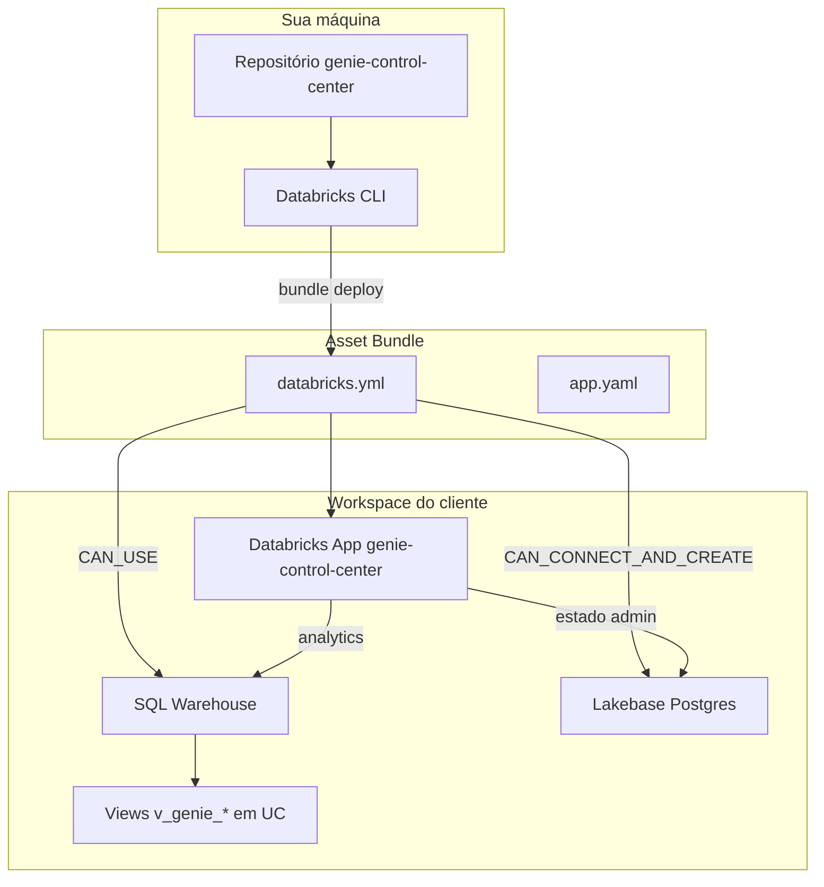

# Instalação — Genie Control Center

Guia passo a passo para instalar o **Genie Control Center** no workspace Databricks do cliente usando **Databricks Asset Bundles (DAB)**.

O bundle declara o app, o SQL Warehouse e o Lakebase em [`databricks.yml`](../databricks.yml). O deploy sincroniza o código-fonte, provisiona permissões nos recursos vinculados e inicia o app via [`app.yaml`](../app.yaml).

---

## Visão geral do que o bundle faz



| Artefato | Função |
|----------|--------|
| `databricks.yml` | Define bundle, target, variáveis e recursos do app |
| `app.yaml` | Comando de start (`npm run build && npm start`) e env injetados pelo bundle |
| `config/queries/*.sql` | Queries analíticas (lidas pelo AppKit no warehouse) |
| `sql/views_prod.sql` | Template das views UC (rodar **antes** do deploy, fora do bundle) |

> **Importante:** o bundle **não** cria as views Unity Catalog nem as tabelas `dim_*`. Isso é pré-requisito de dados (Fase 2).

---

## Fase 0 — Pré-requisitos

### Ferramentas

| Ferramenta | Versão mínima | Verificação |
|------------|---------------|-------------|
| [Databricks CLI](https://docs.databricks.com/dev-tools/cli/) | v0.22+ (recomendado latest) | `databricks --version` |
| Node.js | 20+ | `node --version` |
| Git | qualquer | `git --version` |

### Permissões no workspace do cliente

O usuário que roda o deploy precisa de:

- Criar e gerenciar **Databricks Apps**
- Criar/usar **SQL Warehouses**
- Acesso ao projeto **Lakebase** (Postgres)
- (Pós-deploy) Conceder permissões ao **Service Principal** do app em UC e system tables

### Recursos Databricks já provisionados

| Recurso | Obrigatório | Notas |
|---------|-------------|-------|
| Workspace serverless | Recomendado | Apps + warehouse serverless |
| System tables | Sim | `system.access.audit`, `system.billing.usage`, `system.access.workspaces_latest` |
| SQL Warehouse | Sim | Anota o **ID** (ex.: `a1b2c3d4e5f6g7h8`) |
| Lakebase (Postgres) | Sim | Projeto com branch `production` (ou equivalente) |
| Unity Catalog | Sim | Catálogo + schema para views (padrão do repo: `main.genie_cc`) |

---

## Fase 1 — Clonar e preparar o repositório

```bash
git clone https://github.com/mousasdatabricks/genie-control-center.git
cd genie-control-center
```

### 1.1 White-label (opcional)

Edite [`client/src/lib/brand-config.ts`](../client/src/lib/brand-config.ts):

```typescript
export const CLIENT_BRAND = {
  orgName: 'Nome do Cliente',
  productName: 'Genie Control Center',
  // ...
};
```

### 1.2 Prefixo Unity Catalog nas queries

O repositório usa por padrão `main.genie_cc` em `config/queries/*.sql`.

Se o cliente usar outro catálogo/schema:

```bash
chmod +x scripts/configure-analytics-schema.sh
./scripts/configure-analytics-schema.sh acme_catalog.genie_analytics
# ou: make configure-schema SCHEMA=acme_catalog.genie_analytics
```

### 1.3 Dependências locais (validação / build opcional)

```bash
npm install
npm run typecheck   # opcional — valida TypeScript antes do deploy
```

O build de produção roda **no ambiente do App** (ver `app.yaml`), não é obrigatório localmente.

---

## Fase 2 — Dados no Unity Catalog (fora do bundle)

Execute no **SQL Editor** ou notebook do workspace do cliente.

### 2.1 Tabelas de referência

Crie e popule (DDL em [`sql/views_prod.sql`](../sql/views_prod.sql)):

- **`dim_spaces`** — um registro por Genie Space (`GET /api/2.0/genie/spaces`)
- **`dim_users`** — e-mail → área de negócio (diretório/SCIM/HR)

### 2.2 Views de abstração

No arquivo `sql/views_prod.sql`, substitua:

```
<<CATALOG>>.<<SCHEMA>>  →  main.genie_cc   (ou o destino do cliente)
```

Execute o script completo. Views criadas:

- `v_genie_usage_daily`
- `v_genie_costs_daily`
- `v_genie_users`
- `v_genie_spaces`
- `v_genie_llm_daily`

### 2.3 Validar action names do Genie

Os filtros de audit variam por release. Confira no ambiente do cliente:

```sql
SELECT DISTINCT action_name
FROM system.access.audit
WHERE service_name = 'databricksGenie'
ORDER BY 1;
```

Ajuste os `action_name` em `views_prod.sql` se necessário.

---

## Fase 3 — Autenticar a CLI

```bash
databricks auth login \
  --host https://<workspace-cliente>.cloud.databricks.com \
  --profile <profile-cliente>
```

Verifique:

```bash
databricks auth profiles | grep <profile-cliente>
# Valid deve ser YES

databricks current-user me -p <profile-cliente>
```

---

## Fase 4 — Descobrir IDs para o bundle

### 4.1 SQL Warehouse ID

**UI:** SQL Warehouses → selecione o warehouse → URL contém o ID.

**CLI:**

```bash
databricks warehouses list -p <profile-cliente> --output json \
  | jq '.[].id'
```

Anote como `SQL_WAREHOUSE_ID`.

### 4.2 Lakebase — branch e database

Liste projetos Lakebase:

```bash
databricks postgres list-projects -p <profile-cliente> --output json
```

Liste branches do projeto:

```bash
databricks postgres list-branches projects/<PROJECT_ID> -p <profile-cliente> --output json \
  | jq '.[].name'
```

Exemplo de saída:

```
projects/genie-cc-db/branches/production
```

Liste databases da branch:

```bash
databricks postgres list-databases \
  "projects/<PROJECT_ID>/branches/production" \
  -p <profile-cliente> --output json \
  | jq '.[].name'
```

Exemplo:

```
projects/genie-cc-db/branches/production/databases/databricks-postgres
```

Anote:

- `POSTGRES_BRANCH`
- `POSTGRES_DATABASE`

> O app cria automaticamente o schema Postgres `genie_cc` no primeiro start (metas, thresholds, anotações, orçamentos).

---

## Fase 5 — Configurar o Asset Bundle

Edite [`databricks.yml`](../databricks.yml) no target `default`:

```yaml
bundle:
  name: genie-control-center

targets:
  default:
    default: true
    mode: production
    workspace:
      host: https://<workspace-cliente>.cloud.databricks.com
      # profile: <profile-cliente>   # opcional — ou use sempre -p na CLI

    variables:
      sql_warehouse_id: <SQL_WAREHOUSE_ID>
      postgres_branch: projects/<PROJECT_ID>/branches/production
      postgres_database: projects/<PROJECT_ID>/branches/production/databases/databricks-postgres
```

### Alternativa: variáveis na linha de comando (sem editar o arquivo)

```bash
databricks bundle deploy -t default -p <profile-cliente> \
  --var sql_warehouse_id=<SQL_WAREHOUSE_ID> \
  --var postgres_branch=projects/<PROJECT_ID>/branches/production \
  --var postgres_database=projects/<PROJECT_ID>/branches/production/databases/databricks-postgres
```

### Múltiplos ambientes (dev / prod)

Adicione targets no `databricks.yml`:

```yaml
targets:
  dev:
    workspace:
      host: https://<workspace-dev>.cloud.databricks.com
    variables:
      sql_warehouse_id: <ID_DEV>
      postgres_branch: projects/<PROJECT_DEV>/branches/production
      postgres_database: projects/<PROJECT_DEV>/branches/production/databases/databricks-postgres

  prod:
    mode: production
    workspace:
      host: https://<workspace-prod>.cloud.databricks.com
    variables:
      sql_warehouse_id: <ID_PROD>
      postgres_branch: projects/<PROJECT_PROD>/branches/production
      postgres_database: projects/<PROJECT_PROD>/branches/production/databases/databricks-postgres
```

Deploy em prod:

```bash
databricks bundle deploy -t prod -p <profile-prod>
databricks bundle run app -t prod -p <profile-prod>
```

---

## Fase 6 — Validar o bundle

Antes do primeiro deploy:

```bash
databricks bundle validate -t default -p <profile-cliente>
```

Corrija erros de sintaxe, variáveis ausentes ou host inválido.

Validação local opcional do projeto:

```bash
npm run lint
npm run typecheck
```

---

## Fase 7 — Deploy com Asset Bundle

### 7.1 Provisionar recursos e sincronizar código

```bash
databricks bundle deploy -t default -p <profile-cliente>
```

O que acontece:

1. Valida `databricks.yml` e resolve variáveis
2. Cria ou atualiza o app **`genie-control-center`**
3. Vincula **SQL Warehouse** (`CAN_USE`) e **Lakebase** (`CAN_CONNECT_AND_CREATE`)
4. Sincroniza o código-fonte para o workspace (exclui `node_modules`, `.env` — ver `.gitignore` / sync rules do bundle)
5. Gera estado Terraform em `.databricks/` (local, não versionar)

### 7.2 Iniciar o app

```bash
databricks bundle run app -t default -p <profile-cliente>
```

O `app.yaml` executa:

```sh
npm ci || npm install   # se node_modules não existir no compute
npm run build           # typegen + client + server
npm start               # Express/AppKit na porta do Apps
```

### 7.3 Atalho com Makefile

```bash
make deploy PROFILE=<profile-cliente>
```

Equivale a `bundle deploy` + `bundle run app`.

### 7.4 Obter a URL do app

```bash
databricks apps get genie-control-center -p <profile-cliente> --output json \
  | jq -r '.url'
```

Padrão típico:

```
https://genie-control-center-<ORG_ID>.<REGION>.databricksapps.com
```

---

## Fase 8 — Permissões pós-deploy

O bundle concede permissões no warehouse e Lakebase ao **Service Principal do app**. Ainda é necessário:

### 8.1 Unity Catalog — SELECT nas views e dimensões

No catálogo do cliente (ex.: `main.genie_cc`), conceda ao SP do app:

```sql
GRANT USE CATALOG ON CATALOG main TO `<app-service-principal>`;
GRANT USE SCHEMA ON SCHEMA main.genie_cc TO `<app-service-principal>`;
GRANT SELECT ON SCHEMA main.genie_cc TO `<app-service-principal>`;
```

### 8.2 System tables

O SP precisa de `SELECT` nas system tables usadas em `views_prod.sql` (via grupo de metastore ou grants documentados pela Databricks para o workspace).

### 8.3 Acesso dos usuários finais (SSO)

```bash
databricks apps set-permissions genie-control-center \
  --json '{
    "access_control_list": [
      {
        "group_name": "<grupo-sso-do-cliente>",
        "permission_level": "CAN_USE"
      }
    ]
  }' \
  -p <profile-cliente>
```

**UI:** Compute → Apps → `genie-control-center` → Permissions → Add → Group → **Can use**.

---

## Fase 9 — Verificação pós-instalação

| # | Verificação | Como |
|---|-------------|------|
| 1 | App em execução | `databricks apps get genie-control-center` → status `RUNNING` |
| 2 | Health Lakebase | Abrir `/admin` → indicadores de conexão verdes |
| 3 | Analytics | Abrir `/` (Visão Geral) → KPIs com dados |
| 4 | Paygo | Abrir `/billing` → projeção e usuários |
| 5 | Admin | Metas por área editáveis e persistidas |

Logs do app:

```bash
databricks apps logs genie-control-center -p <profile-cliente> --tail 100
```

---

## Atualizações (re-deploy)

Após alterações no código ou configuração:

```bash
git pull
# reconfigurar variáveis se mudaram
databricks bundle deploy -t default -p <profile-cliente>
databricks bundle run app -t default -p <profile-cliente>
```

Somente mudanças em `databricks.yml` (recursos/variáveis):

```bash
databricks bundle deploy -t default -p <profile-cliente>
```

---

## Referência rápida — comandos DAB

| Ação | Comando |
|------|---------|
| Validar | `databricks bundle validate -t default -p <profile>` |
| Deploy | `databricks bundle deploy -t default -p <profile>` |
| Iniciar app | `databricks bundle run app -t default -p <profile>` |
| Resumo do deploy | `databricks bundle summary -t default -p <profile>` |
| Destruir recursos do bundle | `databricks bundle destroy -t default -p <profile>` |

> Use `bundle destroy` com cuidado — remove o app e desvincula recursos declarados no bundle.

---

## Troubleshooting (DAB)

| Sintoma | Causa provável | Solução |
|---------|----------------|---------|
| `bundle validate` falha em variáveis | Placeholders não substituídos | Preencher `databricks.yml` ou passar `--var` |
| Deploy OK, app `CRASHED` | Build npm falhou | `databricks apps logs genie-control-center` |
| Gráficos vazios | Views UC inexistentes ou prefixo errado | Rodar `views_prod.sql`; conferir `config/queries/` |
| Admin sem DB | Lakebase branch/database incorretos | Revalidar com `list-branches` / `list-databases` |
| `PERMISSION_DENIED` no warehouse | ID errado ou sem `CAN_USE` | Conferir `sql_warehouse_id` no target |
| Usuários não abrem o app | Falta `CAN_USE` no grupo | Fase 8.3 |
| Mudança de schema UC | Queries com prefixo antigo | `./scripts/configure-analytics-schema.sh <novo>` + redeploy |

---

## Checklist de handoff (cliente)

- [ ] Workspace URL e profile CLI com permissão de Apps
- [ ] SQL Warehouse ID
- [ ] Lakebase: `postgres_branch` + `postgres_database`
- [ ] Views `v_genie_*` criadas em UC
- [ ] `dim_spaces` e `dim_users` populadas
- [ ] Prefixo UC nas queries (`main.genie_cc` ou customizado)
- [ ] `databricks bundle validate` sem erros
- [ ] `databricks bundle deploy` + `bundle run app` concluídos
- [ ] Grants UC + system tables para o SP do app
- [ ] Grupo SSO com `CAN_USE` no app
- [ ] URL do app entregue ao time de plataforma/CoE

---

## Demo com dados sintéticos (opcional)

Para POC sem system tables, use `sql/demo_01_data.sql` + `sql/demo_02_views.sql` e aponte as queries ao schema de demo. Exemplo de referência: [examples/heineken/](examples/heineken/).

---

## Arquivos relacionados

| Arquivo | Descrição |
|---------|-----------|
| [`databricks.yml`](../databricks.yml) | Definição do Asset Bundle |
| [`app.yaml`](../app.yaml) | Runtime do Databricks App |
| [`sql/views_prod.sql`](../sql/views_prod.sql) | Views de produção |
| [`scripts/configure-analytics-schema.sh`](../scripts/configure-analytics-schema.sh) | Troca prefixo UC nas queries |
| [`Makefile`](../Makefile) | Atalhos `deploy`, `configure-schema` |
